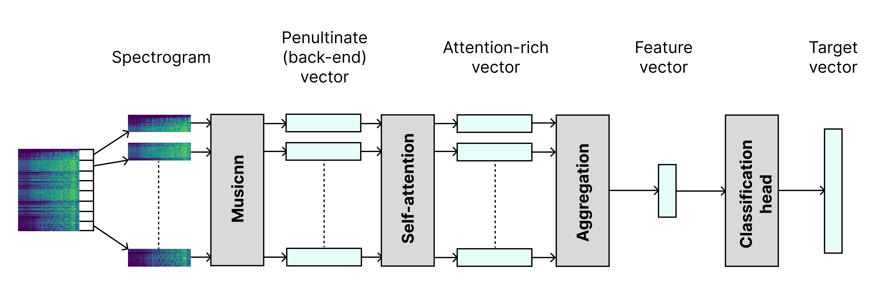

# Ukrainian Music And Its Place In a Genre Map: In-depth Analysis Using Neural Networks
This is a repository with code and data written and collected for my bachelor thesis on topic "Ukrainian Music And Its Place In a Genre Map: In-depth Analysis Using Neural Networks".

It contains a custom audio feature extraction pipeline, training code and pretrained weights, along with the proposed dataset of metadata for 3,000 Ukrainian songs collected specifically for this thesis. 

> Note: The official implementation and training code of [Musicnn](#references) served as the base code for further experiments with the architecture modifications and training setup.

## Abstract
As the music industry grows and more new artists appear every year, the traditional
genre labels can no longer cover the whole spectrum of the newly developed music
styles. This limitation critically impacts both music recommendation systems and
generative models prompted by textual input. The challenge is particularly acute
for non-English music like Ukrainian, which often lacks proper labeling and analysis. In this thesis, we present a lightweight yet effective audio representation extraction pipeline designed to extract meaningful lower-dimensional features for full-length
audio pieces. We enhance the architecture of the musically motivated CNN-based
model, Musicnn, with an attention mechanism and a supervised album-level training
approach independent of predefined genre labels. For the model evaluation and training, we collected a dataset of over 3,000 songs from Ukrainian artists with various
metadata, including genre tags, popularity, and album information. The proposed
album-based training approach shows competitive results on objective and subjective
metrics, in comparison to the traditional genre label-dependent approach, revealing
the potential of the former. Finally, the extracted feature vectors are visualized on
a 2-dimensional map of songs, uncovering stylistic relationships between Ukrainian
artists and their music. Together, this thesis takes the first steps in incorporating
audio-based deep learning methods into the Ukrainian music exploration process aiming to uncover its emerging genre structures and unique style characteristics without
dependence on manual genre labeling. 

## Project tree
```
├───configs                     # support files for data preprocessing steps documentation.
├───data                        # raw fetched data and interim datasets left so that the whole
|   |                           # collection and preprocessing steps are documented.
│   ├───interim_v1
│   ├───raw_v1
│   ├───subjective_metric
│   └───train_val_test_split_v1
├───dataset_notebooks           # .ipynb notebooks used for data fetching, preprocessing and analysis;
|                               # each notebook states its goal and output files at the beginning.
├───deliverables                # final deliverables of the thesis.
│   ├───2d_map                  # 2D maps with extracted features visualizations.
│   ├───dataset                 # collected dataset of metadata for ~3k Ukrainian songs.
│   └───trained_weights         # pretrained weights for gerne and album model.
│       ├───ukr_songs_v1_2k_album_v5_continue       
│       └───ukr_songs_v1_2k_genre
├───evaluation_notebooks        # .ipynb notebooks used for trained models evaluation.
├───figures                     # proposed model architecture image for ReadMe.
├───model_training              # model training and preprocessing dir.
│   ├───musicnn_training        # proposed model architecture, training code and inference
                                # (modified codebase of originalMusicnn implememtation).
```

## Deliverables
Here is the short overview of three main deliverables located in the [deliverables](./deliverables) folder of this repository:

### [Dataset](./deliverables/dataset/)
The dataset consists of metadata and audio features for over 3,000 Ukrainian songs. It includes genre tags, popularity metrics, and album-level metadata. The dataset was colleted specifically for this thesis and is located in the `deliverables/dataset` folder.

Apart from the main CSV file `merged_ukr_songs_v1_3k.csv` with songs and album/genre tags used during training, we present several additional datasets with more detailed metadata for artists and albums. A more details description of the collection process and resulting CSV files is mentioned in a separate [README.md](./deliverables/dataset/README.md).

### [Pretrained Weights](./deliverables/trained_weights/)
The repository provides pretrained weights for two versions of the model:
- **Genre-based model**: Trained using traditional genre labels (baseline);
- **Album-based model**: Trained using album-level metadata to predict stylistic relationships between songs.

The weights are stored in the `deliverables/trained_weights` folder and can be used for inference or further fine-tuning.

### [2D Map of Songs](./deliverables/2d_map)
The final deliverable is a 2-dimensional visualization of the extracted feature vectors for the whole dataset of songs that helps to explore and uncover stylistic relationships between Ukrainian songs and artists. We present two versions of the 2D map:
* `merged_ukr_songs_v1_2k_genre_v1_tsne_artist.html`: visualize features extracted from model trained on **genre tags**;
* `merged_ukr_songs_v1_2k_album_v5_continue_tsne_artist.html`: visualize features extracted from model trained on **album labels**.

Both maps where colored according to the K-Means clusters for k=20 and visualized with t-SNE dimensionality reduction approach.

## Model architecture and training
We adopt the Musicnn architecture with three key modifications to enable full-song processing and extraction of a single feature vector for a whole song:

1. **Full-audio processing**: The model processes variable-length audio by splitting it into 3-second segments (matching Musicnn's original input size used during main model training), allowing analysis of complete tracks.
2. **Aggregation**: A self-attention mechanism with positional encodings is employed to combine segment-level features, preserving temporal structure. The aggregated output is compressed into a compact representation via a Dense Neural Network (DDN) layer. Several aggregation approaches, such as flatten, mean/max pooling, and attention pooling, are explored.
3. **Classification head**: A simple dense layer is added on top to produce the final prediction vector of targets (either genre or album).

The general architecture of the proposed models is visualized below:




## Setup 
Install ffmpeg for audio processing:
```bash
apt update
apt install ffmpeg -y
```
Install required python packages:
```bash
cd ukr_music_genre_map
pip install -r requirements_v2.txt
```

## Usage

### Inference script
To test the whether the installation process was successful, you can run an [inference script](./model_training/musicnn_training/src/inference.py) for a test audio using the following command:

```bash
python model_training/musicnn_training/src/inference.py test_audio.mp3
```
This will load the album version of the pretrained models by default and run inference for your test audio `test_audio.mp3`. The expected output format is:
```bash
{
    'normalized_y': np.ndarray,
    'feature_vectors': np.ndarray
}
```

To use a different checkponit you can specify the path to the target checkpoint in `--checkpoint` flag. Here is the example for using the genre version of the pretrained model:
```bash
python model_training/musicnn_training/src/inference.py test_audio.mp3 --checkpoint deliverables/trained_weights/ukr_songs_v1_2k_genre
```

### Call from python
```python
from model_training.musicnn_training.src.inference import MusicFeatureExtractor

checkpoint_dir = "path_to_checkpoint_dir"
audio_path = "test_audio.mp3"

extractor = MusicFeatureExtractor(checkpoint_dir)   # initialize the model and load pretrained weights
features = extractor.extract_features(audio_path)   # extract features and target predictions

print(features)
```

## References
```
@inproceedings{pons2018atscale,
  title={End-to-end learning for music audio tagging at scale},
  author={Pons, Jordi and Nieto, Oriol and Prockup, Matthew and Schmidt, Erik M. and Ehmann, Andreas F. and Serra, Xavier},
  booktitle={19th International Society for Music Information Retrieval Conference (ISMIR2018)},
  year={2018},
}
```
```
@inproceedings{pons2019musicnn,
  title={musicnn: pre-trained convolutional neural networks for music audio tagging},
  author={Pons, Jordi and Serra, Xavier},
  booktitle={Late-breaking/demo session in 20th International Society for Music Information Retrieval Conference (LBD-ISMIR2019)},
  year={2019},
}
```